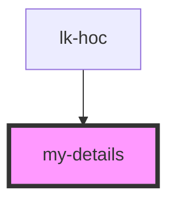

# my-details

<!-- Auto Generated Below -->

## Properties

| Property       | Attribute       | Description | Type     | Default     |
| -------------- | --------------- | ----------- | -------- | ----------- |
| `contentData`  | `content-data`  |             | `any`    | `undefined` |
| `languageCode` | `language-code` |             | `string` | `undefined` |

## Dependencies

### Used by

 - [lk-hoc](..)

### Graph

----------------------------------------------

*Built with [StencilJS](https://stenciljs.com/)*
