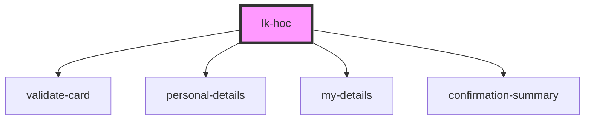

# lk-hoc

<!-- Auto Generated Below -->

## Properties

| Property            | Attribute            | Description | Type     | Default     |
| ------------------- | -------------------- | ----------- | -------- | ----------- |
| `languageCode`      | `language-code`      |             | `string` | `undefined` |
| `selectedComponent` | `selected-component` |             | `string` | `undefined` |

## Dependencies

### Depends on

- [validate-card](validate-card)
- [personal-details](personal-details)
- [my-details](my-details)
- [confirmation-summary](confirmation-summary)

### Graph

----------------------------------------------

*Built with [StencilJS](https://stenciljs.com/)*
